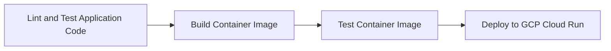

# The Mascot API

The Mascot API is a Python application that serves JSON over HTTP using the flask framework.

The Project also includes a really awesome pipeline with the following stages:

```mermaid
graph LR
    A[Lint and Test Application Code] --> B[Build Container Image]
    B --> C[Test Container Image]
    C --> D[Deploy to GCP Cloud Run]
```
